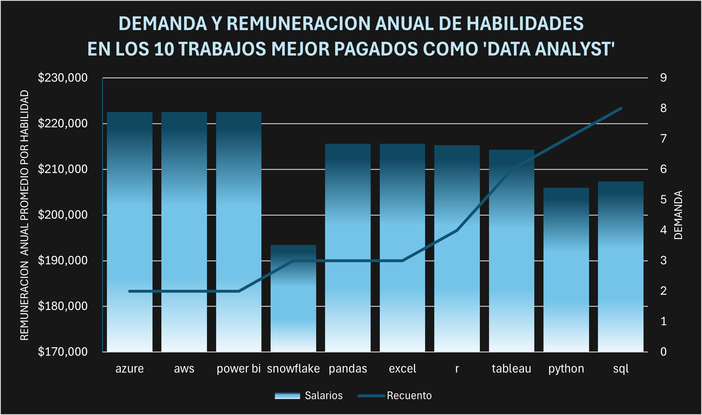

## ¡Descubre los trabajos de tus sueños en Data Analytics! 

**¿Te preguntas cuáles son los trabajos mejor pagados en el mundo del análisis de datos y qué habilidades necesitas para alcanzar el éxito?** ¡Este proyecto tiene las respuestas! 

En este repositorio encontrarás mi proyecto final para el curso 'SQL for Data Analytics' con el increíble Luke Barousse. Usando SQL como mi arma secreta, buceé en un dataset de [Data Nerd](https://datanerd.tech/About) para desvelar los misterios del mercado laboral de los _data analyst_.

**¿Qué encontré?** ¡Pues prepárate para sorprenderte! Con mis consultas SQL, logré identificar los trabajos más codiciados y las habilidades más demandadas. ¡Ahora tú también puedes tomar las riendas de tu carrera!

**¿Qué aprenderás aquí?**

* **SQL al máximo:** Verás cómo utilicé un montón de funciones y cláusulas SQL para manipular y analizar los datos como un auténtico profesional.
* **Explorando datos como un detective:** Descubrirás cómo encontrar patrones y tendencias ocultas en los datos.

**¿Quieres ver mis consultas SQL?** ¡Claro que sí! Échales un vistazo en la carpeta [project_sql](/project_sql/). 

**¡Súbete a bordo y explora este proyecto!** 

**#SQL #DataAnalytics #DataScience #JobMarket #coding**

**¡Aprende, comparte y diviértete con los datos!**

## ¡Manos a la obra! 

Ahora que ya conoces el objetivo del proyecto, vamos a sumergirnos en el "cómo". 

Los datos provienen directamente del [Curso de SQL](https://lukebarousse.com/sql) . Este conjunto de datos está repleto de información valiosa sobre puestos de trabajo, salarios, ubicaciones y, por supuesto, ¡las habilidades más demandadas! 

**Las preguntas clave que buscaba responder con mis consultas SQL fueron:**

1.  ¿Cuáles son los trabajos remotos de analista de datos mejor pagados? 
2.  ¿Qué habilidades se requieren para estos puestos top?  
3.  ¿Cuáles son las habilidades más demandadas para los analistas de datos en general?  
4.  ¿Qué habilidades están asociadas con salarios más altos? 
5.  ¿Cuáles son las habilidades más óptimas para aprender   (¡Para impulsar tu carrera al máximo!) 

**¡Con las preguntas claras, era hora de desatar el poder de las consultas SQL!**  En la carpeta [project_sql](/project_sql/) encontrarás las consultas que utilicé para develar los secretos del mercado laboral del _data analyst_. 

**¡No te lo pierdas!** Explora las consultas, analiza los resultados y descubre el camino hacia tu trabajo ideal.

## ¡Las herramientas de mi arsenal! 

Para este emocionante viaje por el mercado laboral del _data analyst_, me apoyé en estas poderosas herramientas:

* **SQL:** El corazón de mi análisis. Con SQL, pude interrogar la base de datos y extraer información crucial.
* **PostgreSQL:** El sistema de gestión de bases de datos elegido. Ideal para manejar los datos de los anuncios de trabajo. 
* **Visual Studio Code:** Mi fiel compañero para la gestión de bases de datos y la ejecución de consultas SQL.
* **Git & GitHub:** Indispensables para el control de versiones y el intercambio de mis scripts SQL y análisis, asegurando la colaboración y el seguimiento del proyecto.

**¡Con este equipo, estaba listo para explorar los datos y descubrir los secretos del mercado laboral!**

## ¡Descifrando el mercado!

Cada consulta de este proyecto se centró en investigar aspectos específicos del mercado laboral del analista de datos. Aquí te muestro cómo abordé cada pregunta:

### 1. Los trabajos remotos de analista de datos mejor pagados

**Para identificar los puestos mejor pagados, filtré las posiciones de analista de datos por salario promedio anual y ubicación, centrándome en el trabajo remoto.** Esta consulta expone las oportunidades más lucrativas en el campo. 

```sql
SELECT
    job_id,
    job_title,
    job_schedule_type,
    salary_year_avg,
    job_posted_date,
    name AS company_name
FROM job_postings_fact as jp
LEFT JOIN
    company_dim AS cd ON jp.company_id = cd.company_id
WHERE
    jp.job_work_from_home = TRUE AND
    jp.job_title_short = 'Data Analyst' AND
    salary_year_avg IS NOT NULL
ORDER BY
    salary_year_avg DESC
LIMIT 10;
```
Tres puntos clave del analisis de los mejores trabajos remotos de _data analyst_ en el 2023.

#### 1. **Salarios promedio**

* **El puesto mejor pagado es "Data Analyst"** con un salario promedio anual de $650,000.
* **Los puestos de "Director" y "Associate Director"** también tienen salarios considerables, superando los $200,000 anuales.
* **El puesto más bajo en salario es "ERM Data Analyst"** con un promedio de $184,000 al año.

 #### 2. **Tendencias de contratación**

* **La mayoría de los puestos son de tiempo completo (Full-time)**, lo que refleja la clara necesidad de las empresas a profecionales dedicados al campo.
* **Los anuncios de trabajo se distribuyen a lo largo del año**, sin un patrón estacional claro.

#### 3. **Empresas líderes**

* **Mantys destaca como la empresa con el puesto mejor pagado** ("Data Analyst").
* **Meta y AT&T también están presentes** en la lista con puestos de alto nivel.

**¡Estos análisis nos brindan una visión general del mercado laboral de los analistas de datos!**


*Grafico de barras donde se visualizan los salarios de los 10 trabajos mejor pagados como **Data Analyst**; hecho en Excel apartir de los resultados optenidos en las consultas SQL*

### 2. ¿Que necesitas para conseguir estos empleos?
```sql
WITH top_paying_jobs AS (
    SELECT
        job_id,
        job_title,
        salary_year_avg,
        name as company_name
    FROM job_postings_fact as jp
    LEFT JOIN
        company_dim AS cd ON jp.company_id = cd.company_id
    WHERE
        jp.job_work_from_home = TRUE AND
        jp.job_title_short = 'Data Analyst' AND
        salary_year_avg IS NOT NULL
    ORDER BY
        salary_year_avg DESC
    LIMIT 10
)

SELECT
    top_paying_jobs.*,
    skills
FROM top_paying_jobs
INNER JOIN skills_job_dim ON top_paying_jobs.job_id = skills_job_dim.job_id
INNER JOIN skills_dim ON skills_job_dim.skill_id = skills_dim.skill_id
ORDER BY
    salary_year_avg DESC;
```


#### 1. **Habilidades de mayor remuneración:**

* **SQL sigue siendo el rey:** SQL aparece en todos los trabajos analizados, lo que confirma su importancia fundamental en el campo.
* **Python y R:** Estas herramientas de programación son esenciales para la manipulación y análisis de datos, y también son altamente demandadas.
* **Cloud Computing:** Con habilidades como Azure y AWS, los analistas pueden trabajar con grandes conjuntos de datos y aprovechar la infraestructura en la nube.

#### 2. **Habilidades complementarias:**

* **Visualización de datos:** Herramientas como Tableau y Power BI son cruciales para comunicar hallazgos de manera efectiva.

#### 3. **Habilidades especializadas:**

* **Dominio de herramientas específicas:** Dependiendo del campo de trabajo, habilidades como Excel y Snowflake pueden ser ventajas adicionales.

**¡Estas habilidades son clave para impulsar tu carrera como analista de datos!**

***Recuerda:** El mercado laboral está en constante evolución, por lo que es importante mantenerse actualizado con las últimas tendencias y tecnologías.*



*Grafico de columnas donde se visualizan las habilidades necesarias para tener los trabajos mejor pagados como **Data Analyst**, así como tambien la remuneración promedio asociada a las mismas; hecho en Excel apartir de los resultados optenidos en las consultas SQL*

### 3. ¡Las habilidades más demandadas en todo el sectoe!

#### 1. SQL dominando el mercado:
Con 7.291 menciones, SQL se consolida como la habilidad más buscada en el mercado laboral.

#### 2. Python y R: El Dúo Dinámico para el Análisis de Datos:
Tanto Python como R han experimentado un crecimiento significativo en los últimos años. Ambas ofrecen una amplia gama de librerías y paquetes para realizar tareas como limpieza de datos, modelado estadístico, machine learning y visualización.

#### 3. Visualización de Datos: Una Habilidad Esencial
Herramientas como Tableau y Power BI permiten comunicar los resultados de un análisis de datos de manera clara y concisa.

| Habilidad | Demanda |
|---|---|
| SQL | 7.291 |
| Excel | 4.611 |
| Python | 4.330 |
| Tableau | 3.745 |
| Power BI | 2.609 |

*Tabla; se muestran las 5 habilidades más demandadas para los puestos de **'data analyst'***

### 4. Habilidades mejor pagadas
Descubramos cúales son las habilidades mejor remuneradas

```sql
SELECT 
    sd.skills as skill_name,
    ROUND(AVG(salary_year_avg), 0) AS avg_salary
FROM
    skills_dim sd
INNER JOIN skills_job_dim sj ON sj.skill_id = sd.skill_id
INNER JOIN job_postings_fact jp ON jp.job_id = sj.job_id
WHERE
    jp.job_work_from_home = TRUE AND
    salary_year_avg IS NOT NULL AND
    jp.job_title_short = 'Data Analyst'
GROUP BY sd.skills
ORDER BY avg_salary DESC
LIMIT 25;
```

Resumen de los hallazgos

* **Alta demanda de habilidades de Big Data y ML:** Los salarios más altos son comandados por analistas con habilidades en tecnologías de big data (PySpark, Couchbase), herramientas de aprendizaje automático (DataRobot, Jupyter) y bibliotecas de Python (Pandas, NumPy), lo que refleja la alta valoración de la industria de las capacidades de procesamiento de datos y modelado predictivo.
* **Proficiencia en desarrollo de software e implementación:** El conocimiento de herramientas de desarrollo e implementación (GitLab, Kubernetes, Airflow) indica un lucrativo cruce entre el análisis de datos y la ingeniería, con una prima en las habilidades que facilitan la automatización y la gestión eficiente de los pipelines de datos.
* **Experiencia en computación en la nube:** La familiaridad con herramientas de ingeniería de datos y la nube (Elasticsearch, Databricks, GCP) subraya la creciente importancia de los entornos de análisis basados en la nube, lo que sugiere que la competencia en la nube aumenta significativamente el potencial de ingresos en el análisis de datos.

| Habilidad | Salario anual promedio en $ |
|---|---|
| Pyspark | 208,172 |
| Bitbucket | 189,155 |
| Couchbase | 160,515 |
| Watson | 160,515 |
| Datarobot | 155,486 |
| Gitlab | 154,500 |
| Swift | 153,750 |
| Jupyter | 152,777 |
| Pandas | 151,821 |
| Elasticsearch | 145,000 |
| Golang | 145,000 |
| Numpy | 143,513 |
| Databricks | 141,907 |
| Linux | 136,508 |
| Kubernetes | 132,500 |
| Atlassian | 131,162 |
| Twilio | 127,000 |
| Airflow | 126,103 |
| Scikit-Learn | 125,781 |
| Jenkins | 125,436 |
| Notion | 125,000 |
| Scala | 124,903 |
| Postgresql | 123,879 |
| GCP | 122,500 |
| Microstrategy | 121,619 |

*Tabla; muestra en orden descendente las 25 habilidades con mayores salarios anuales promedios; recopilado de todas las ofertas de empleo remoto como **'data analyst'***

### 5. ¿Cuales son las habiidades optimas que aprender?
Combinando los hallazgos obtenidos hasta ahora podemos determinar que lo más óptimo sea aprender una habiidad que ofrezca buenos sueldos y tenga una alta demanda, para ellos el siguiente query utiliza CTEs para ahondar en esta pegunta.

```sql
WITH combined_data AS (
    SELECT
        sd.skill_id,
        sd.skills,
        COUNT(sj.skill_id) AS demand_count,
        ROUND(AVG(jp.salary_year_avg), 0) AS avg_salary
    FROM
        skills_dim sd
    INNER JOIN skills_job_dim sj ON sj.skill_id = sd.skill_id
    INNER JOIN job_postings_fact jp ON jp.job_id = sj.job_id
    WHERE
        jp.job_work_from_home = TRUE AND
        jp.job_title_short = 'Data Analyst' AND
        salary_year_avg IS NOT NULL
    GROUP BY sd.skill_id
), ranked_skills AS (
    SELECT
        skill_id,
        skills,
        demand_count,
        avg_salary,
        ROW_NUMBER() OVER (ORDER BY avg_salary DESC, demand_count DESC) AS rank
    FROM
        combined_data
    WHERE
        demand_count > 10
)
SELECT
    skill_id,
    skills,
    demand_count,
    avg_salary
FROM
    ranked_skills
WHERE
    rank <= 30
ORDER BY
    rank ASC;
```
| Habilidad | Demanda | Salario anual promedio ($) |
|---|---|---|
| Go | 27 | 115,320 |
| Confluence | 11 | 114,210 |
| Hadoop | 22 | 113,193 |
| Snowflake | 37 | 112,948 |
| Azure | 34 | 111,225 |
| BigQuery | 13 | 109,654 |
| AWS | 32 | 108,317 |
| Java | 17 | 106,906 |
| SSIS | 12 | 106,683 |
| Jira | 20 | 104,918 |
| Oracle | 37 | 104,534 |
| Looker | 49 | 103,795 |
| NoSQL | 13 | 101,414 |
| Python | 236 | 101,397 |
| R | 148 | 100,499 |
| Redshift | 16 | 99,936 |
| Qlik | 13 | 99,631 |
| Tableau | 230 | 99,288 |
| SSRS | 14 | 99,171 |
| Spark | 13 | 99,077 |
| C++ | 11 | 98,958 |
| SAS | 63 | 98,902 |
| SQL Server | 35 | 97,786 |
| Javascript | 20 | 97,587 |
| Power BI | 110 | 97,431 |
| SQL | 398 | 97,237 |
| Flow | 28 | 97,200 |
| Alteryx | 17 | 94,145 |
| SPSS | 24 | 92,170 |

*Tabla con las habilidades óptimas; recopilado de todas las ofertas de empleo remoto como **'data analyst'**; ordenado por salario de mayor a menor*

A partir de los datos proporcionados, podemos realizar un análisis preliminar y extraer las siguientes conclusiones:

#### Tendencias Destacadas
* **Dominancia de Python y SQL:** Estas habilidades fundamentales para el análisis de datos y la gestión de bases de datos muestran una alta demanda y salarios competitivos, consolidándose como pilares en el sector. 
* **Ascenso de las tecnologías en la nube:** Habilidades relacionadas con plataformas como AWS, Azure y GCP evidencian un crecimiento exponencial, reflejando la creciente adopción de la nube en las empresas.
* **Importancia de la visualización de datos:** Herramientas como Tableau y Power BI destacan por su alta demanda, subrayando la necesidad de comunicar los hallazgos de manera efectiva.
* **Crecimiento del Big Data:** Tecnologías como Hadoop y Spark, diseñadas para manejar grandes volúmenes de datos, muestran una demanda sostenida.
* **Perpetuidad de los lenguajes clásicos:** Lenguajes como Java, C++ y JavaScript mantienen su relevancia, demostrando su versatilidad y adaptación a nuevas tecnologías.

## Lo que he aprendido
¡Qué viaje ha sido este curso de SQL!

De novato a experto, he avanzado a pasos agigantados. He adquirido las habilidades necesarias para convertirme en un auténtico analista de datos.

 Crear consultas complejas, dominar **PostgreSQL**, y utilizar herramientas como **Git**, **GitHub**, **Power Query** y **VS Code** me ha abierto un sinfín de posibilidades.

Estoy emocionado por aplicar estos conocimientos en nuevos proyectos y descubrir nuevas formas de transformar datos en información valiosa, explorando los datos con subconsultas y uniones, y tener la posibilidad de colaborar con otros.

*¡Estoy listo para sumergirme en cualquier desafío de análisis de datos que se me presente!*

## Conclusiones
### Insights

1. **Puestos de Analista de Datos Mejor Pagados:**
   * Los trabajos remotos mejor pagados ofrecen salarios de hasta $650,000.

2. **Habilidades para Puestos de Alto Pago:**
   * SQL es una habilidad esencial para obtener salarios altos.

3. **Habilidades Más Demandadas:**
   * SQL lidera en demanda entre los analistas de datos.

4. **Habilidades con Salarios Más Altos:**
   * Habilidades especializadas como SWN y Solidity ofrecen salarios más altos.

5. **Habilidades Óptimas para el Valor del Mercado:**
   * SQL es una habilidad altamente valiosa para los analistas de datos.

### Consideraciones finales
Gracias a este proyecto, he fortalecido mis conocimientos en SQL y he adquirido una valiosa perspectiva sobre el dinámico mercado laboral de los **_'data analyst'_**. Los resultados de mi análisis me han permitido identificar las habilidades más demandadas y mejor remuneradas, lo que me permitirá trazar una hoja de ruta más efectiva para mi desarrollo profesional.
